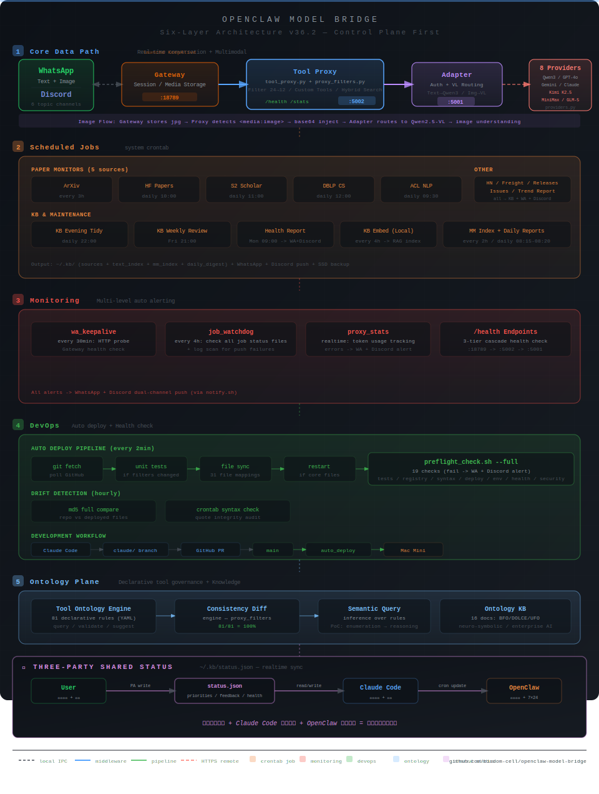

# openclaw-model-bridge

> **Agent Runtime Control Plane** — Connect any LLM to [OpenClaw](https://github.com/openclaw/openclaw) with one command. Zero dependencies, 7 providers, multimodal support.
> 将任意大模型（Qwen / OpenAI / Gemini / Claude / Kimi / MiniMax / GLM）一键接入 OpenClaw — 零第三方依赖、支持多模态、10 分钟跑通。

[](https://opensource.org/licenses/MIT)
[](https://www.python.org/downloads/)
[]()
[]()
[]()
[-blue.svg)]()
[]()
[]()

## Architecture / 系统架构



<details>
<summary>Text version / 文本版本</summary>

```
┌─────────────────────────────────────────────────────────────────┐
│                 用户层 (WhatsApp + Discord 双通道)                │
│             文本 / 图片 / 语音消息 | 6个Discord频道               │
└────────────────────────┬────────────────────────────────────────┘
                         │
┌────────────────────────▼────────────────────────────────────────┐
│  ① 核心数据通路（实时对话 + 多模态 + SLO 监控）                   │
│                                                                  │
│  WhatsApp ←┐                                                     │
│  Discord  ←┼→ Gateway (:18789) ←→ Proxy (:5002) ←→ Adapter (:5001) ←→ LLM (7 Providers) │
│            │  [launchd]           [策略过滤+监控]    [认证+Fallback]    [Qwen3-235B]       │
│            │  [媒体存储]          [图片base64注入]   [VL模型路由]       [+6 more providers] │
│  notify.sh ┘  [双通道推送]        [自定义工具注入]    [→Gemini降级]                        │
│                                   data_clean(清洗)                                       │
│                                   search_kb(混合检索)                                    │
│                                   [SLO指标采集]                                          │
│                                   延迟p95/错误分类                                       │
│                                   工具成功率/降级率                                      │
│                                                                  │
│  search_kb流程：用户问论文 → PA调search_kb → Proxy拦截           │
│    → ①语义搜索(embedding cosine) + ②关键词补充                   │
│    → 支持source过滤(arxiv/hf/hn等) + 时间过滤(recent_hours)      │
│    → 结果注入对话 → followup LLM调用 → 自然语言回答              │
└──────────────────┬──────────────────┬───────────────────────────┘
                   │                  │
┌──────────────────▼──────────────────▼───────────────────────────┐
│  ② 知识库 + 本地 AI（零 API 调用）                                │
│                                                                  │
│  KB Notes + Sources ──→ kb_embed.py ──→ 本地 Embedding (384维)   │
│                          (sentence-transformers, 每4h增量)        │
│                                ↓                                 │
│                         ~/.kb/text_index/ ──→ kb_rag.py (RAG)    │
│                                                                  │
│  媒体文件 ──→ mm_index.py ──→ Gemini Embedding 2 (768维)         │
│                     ↓                                            │
│              ~/.kb/mm_index/ ──→ mm_search.py (语义搜索)          │
└──────────────────────────────────────────────────────────────────┘
                   │
┌──────────────────▼──────────────────────────────────────────────┐
│  ③ 定时任务层（32 个 system cron jobs，28 active）                │
│                                                                  │
│  论文监控矩阵（5源）：                                            │
│    ArXiv(每3h) + HF Papers(10:00) + S2(11:00)                   │
│    + DBLP(12:00) + ACL(09:30) ──→ KB + WhatsApp + Discord推送   │
│  每3h   HN热帖抓取 ──→ KB + WhatsApp + Discord推送               │
│  每天×3 货代Watcher ──→ LLM分析 + KB + WhatsApp + Discord推送    │
│  每天   OpenClaw Releases ──→ LLM摘要 + KB + WhatsApp + Discord  │
│  每小时 Issues监控 ──→ KB + WhatsApp + Discord推送               │
│  每天   KB每日摘要 / 晚间整理 / 智能去重                          │
│  每4h   KB 向量索引（本地 embedding）                             │
│  每2h   多媒体索引（Gemini Embedding 2）                          │
│  每天   对话质量日报 / Token用量日报                              │
│  每周   KB深度回顾 / 健康周报 / AI趋势报告                        │
│  每天   Gateway state 备份（外挂 SSD）                            │
│  每30m  WhatsApp 保活                                            │
│  每4h   Job Watchdog（元监控告警）                                │
│  每2m   auto_deploy（Git→运行时自动同步）                         │
└──────────────────────────────────────────────────────────────────┘
                   │
┌──────────────────▼──────────────────────────────────────────────┐
│  ④ 控制平面（SLO + 阈值中心化 + 故障快照 + 19项体检 + CI）        │
│                                                                  │
│  Claude Code → claude/分支 → PR → main → auto_deploy → Mac Mini  │
│       config.yaml: 统一阈值配置（70+参数，9个分区）               │
│       SLO 5指标: 延迟p95<30s / 工具成功>95% / 降级<5%            │
│                  超时<3% / 自动恢复>90%                           │
│       auto_deploy: 文件同步(35个) + 漂移检测 + 按需restart        │
│       preflight: 19项检查（单测+注册表+语法+部署+安全+E2E+SLO）   │
│       故障快照: 连续错误→自动采集日志+状态→~/.kb/incidents/        │
│       pre-commit: API key/手机号泄漏+语法检查                     │
│       GitHub Actions CI: 9套单测+注册表+配置校验+安全扫描+bandit  │
└──────────────────────────────────────────────────────────────────┘
                   │
┌──────────────────▼──────────────────────────────────────────────┐
│  ⑤ Ontology Plane（语义控制平面 + 运行时治理 + 知识体系）           │
│                                                                  │
│  ontology/                                                       │
│    engine.py ←→ tool_ontology.yaml (81条声明式规则)              │
│      └→ classify_tool_call(): 语义推理(属性→风险+策略标签)       │
│    governance_checker.py ←→ governance_ontology.yaml v3          │
│      └→ 15不变式 + 32检查 + 6元规则 + 验证深度三层模型           │
│      └→ MRD-LAYER-001: 自动发现单层验证盲区                     │
│    diff.py: engine ↔ proxy_filters 一致性校验 (81/81=100%)      │
│    Phase 2 shadow: off→shadow→on (Mac Mini 生产运行中)           │
│    CONSTITUTION.md: 宪法6条 + 最高条款（项目隔离）                │
└──────────────────────────────────────────────────────────────────┘
                   │
┌──────────────────▼──────────────────────────────────────────────┐
│  ⑥ 三方共享状态（~/.kb/status.json 实时同步）                     │
│                                                                  │
│  用户(WhatsApp+Discord) ←→ PA ←→ status.json ←→ Claude Code    │
│  反馈+决策                 写入    优先级/反馈    读/写            │
│                                   健康/SLO/焦点  ←→ Cron自动更新  │
│                                                                  │
│  宪法：用户专业深度 + Claude Code设计部署 + OpenClaw数据复利       │
│        三者合一 = 有生命的闭环系统                                 │
└──────────────────────────────────────────────────────────────────┘
```

</details>

| Component | Port | Files | Role |
|-----------|------|-------|------|
| OpenClaw Gateway | 18789 | npm global | WhatsApp integration, media storage, tool execution, session management |
| Tool Proxy | 5002 | `tool_proxy.py` + `proxy_filters.py` | Tool filtering (24→12), **custom tools** (data_clean + search_kb hybrid search), **image base64 injection**, SSE conversion, truncation, token monitoring, **SLO metrics collection**, **incident snapshots** |
| Adapter | 5001 | `adapter.py` + `providers.py` | **7-provider** forwarding, auth, **multimodal routing** (text→Qwen3, image→Qwen2.5-VL), fallback degradation |
| Config Center | — | `config.yaml` + `config_loader.py` | Centralized thresholds (70+ params, 9 sections: SLO/proxy/tokens/alerts/routing/truncation/watchdog/incidents/jobs) |
| SLO Benchmark | — | `slo_benchmark.py` | SLO compliance — 5 metrics, real production data reports (p95=459ms, 5/5 PASS) |
| Notifications | — | `notify.sh` | **Dual-channel push**: WhatsApp + Discord (6 topic channels: papers/freight/alerts/daily/tech/DM) |
| Local Embedding | — | `local_embed.py` | sentence-transformers (384-dim, 50+ languages), zero API calls |
| Remote LLM | — | 7 providers | Qwen3-235B / GPT-4o / Gemini 2.5 / Claude Sonnet / Kimi K2.5 / MiniMax M2.7 / GLM-5 |

## Supported Providers (7)

| Provider | Default Model | Context | Vision | Auth | Verified |
|----------|--------------|---------|--------|------|----------|
| **Qwen** (Remote GPU) | Qwen3-235B | 262K | Qwen2.5-VL-72B | Bearer | 5/5 (production) |
| **OpenAI** | GPT-4o | 128K | built-in | Bearer | available |
| **Google Gemini** | Gemini 2.5 Flash | 1M | built-in | Bearer | 2/5 (fallback) |
| **Anthropic Claude** | Claude Sonnet 4.6 | 200K | built-in | x-api-key | available |
| **Kimi** (Moonshot AI) | Kimi K2.5 (1T MoE) | 256K | built-in | Bearer | available |
| **MiniMax** | MiniMax M2.7 | 200K | built-in | Bearer | available |
| **GLM** (Zhipu AI) | GLM-5 (744B MoE) | 200K | GLM-5V-Turbo | Bearer | available |

All providers use **OpenAI-compatible API** format. Adding a new provider: see [docs/compatibility_matrix.md](docs/compatibility_matrix.md).

```bash
# Switch provider at runtime
export PROVIDER=kimi && export MOONSHOT_API_KEY=... && bash restart.sh
```

## Quick Start (10 minutes)

**Three steps. Zero third-party dependencies. Any LLM provider.**

```bash
# Step 1: Clone
git clone https://github.com/bisdom-cell/openclaw-model-bridge.git
cd openclaw-model-bridge

# Step 2: Set any ONE API key — quickstart auto-detects your provider
export OPENAI_API_KEY="sk-..."           # OpenAI (GPT-4o)
export GEMINI_API_KEY="..."              # Google Gemini
export ANTHROPIC_API_KEY="sk-ant-..."    # Anthropic Claude
export MOONSHOT_API_KEY="..."            # Kimi (Moonshot AI)
export MINIMAX_API_KEY="..."             # MiniMax
export GLM_API_KEY="..."                 # GLM (Zhipu AI)
export REMOTE_API_KEY="..."              # Custom Qwen endpoint

# Step 3: One command — auto-detects provider, runs 4 phases
bash quickstart.sh
```

**What happens:**

```
Phase 1: Prerequisites     → Python, files, syntax, provider auto-detection
Phase 2: Start Services    → Adapter(:5001) + Proxy(:5002), ~3 seconds
Phase 3: Health Check      → 610 unit tests + registry validation
Phase 4: Golden Test Trace → Real request through full stack, saved to docs/golden_trace.json
```

**Expected output:**

```
✅ Provider: openai (via $OPENAI_API_KEY)
✅ all tests passed
✅ Golden test: "Four" in 521ms (37 prompt + 2 completion tokens)
   Trace saved to docs/golden_trace.json
```

<details>
<summary>Step-by-step alternative / 分步执行</summary>

```bash
bash quickstart.sh --check   # Prerequisites only
bash restart.sh              # Start services
bash quickstart.sh --demo    # Demo request only
```
</details>

<details>
<summary>After Quick Start: optional capabilities</summary>

```bash
# SLO Benchmark — real production metrics report
python3 slo_benchmark.py          # Markdown report (5/5 PASS, p95=459ms)
python3 slo_benchmark.py --json   # JSON format for CI
python3 slo_benchmark.py --save   # Save to docs/slo_benchmark_report.md

# Provider compatibility matrix
python3 providers.py              # Markdown table (7 providers)
python3 providers.py --json       # JSON format

# GameDay fault injection drill
bash gameday.sh --all             # 5 scenarios: GPU timeout, circuit breaker, etc.

# KB RAG semantic search (requires pip install)
pip3 install -r requirements-rag.txt
python3 kb_embed.py && python3 kb_rag.py "AI papers"

# Multimodal memory search (requires pip install + Gemini key)
pip3 install -r requirements-mm.txt
python3 mm_index.py && python3 mm_search.py "cat photos"
```
</details>

### Why Zero Dependencies?

Core services (`tool_proxy.py`, `adapter.py`, `proxy_filters.py`) use **only Python standard library** — `http.server`, `json`, `urllib`. No pip install, no virtual environment, no Docker. This is a deliberate architecture decision: **every dependency you remove is one fewer reason someone can't run your system.**

## Project Structure

### Core Services

| File | Description |
|------|-------------|
| `tool_proxy.py` | HTTP layer — request/response routing, **custom tool execution** (data_clean + search_kb), **media injection**, followup LLM calls, logging, health cascade |
| `proxy_filters.py` | Policy layer — tool filtering, **custom tool injection** (data_clean + search_kb), **image base64 injection** (`<media:image>` → `image_url`), param fixing, truncation, SSE conversion |
| `adapter.py` | API adapter — **7-provider** forwarding, auth, **multimodal routing** (text→Qwen3, image→Qwen2.5-VL), fallback degradation |
| `providers.py` | **V34** Provider Compatibility Layer — BaseProvider abstraction, 7 concrete providers, ProviderRegistry, capability declaration, CLI matrix |
| `slo_benchmark.py` | **V35** SLO Benchmark report generator — reads proxy_stats.json → Markdown/JSON report (latency p50/p95/p99, success rate, degradation) |
| `quickstart.sh` | **V35** One-click Quick Start — 4 phases (prerequisites → services → health → golden test), provider auto-detection |
| `notify.sh` | **V33** Unified notification — WhatsApp + Discord dual-channel push, 6 topic channels |

### Knowledge Base & Local AI

| File | Description |
|------|-------------|
| `local_embed.py` | **V29.3** Local embedding engine — sentence-transformers (multilingual-MiniLM, 384-dim, 50+ languages), zero API calls |
| `kb_embed.py` | **V29.3** KB text vector indexer — notes+sources → chunking (400 chars, 80 overlap) → local embedding → `~/.kb/text_index/` |
| `kb_rag.py` | **V29.3** RAG semantic search — `--context` (LLM injection), `--json` (scripting), `--top N`, `--source` (filter by origin), `--recent N` (time-based) |
| `mm_index.py` | **V29.1** Multimodal memory indexer — Gemini Embedding 2 for images/audio/video/PDF |
| `mm_search.py` | **V29.1** Multimodal semantic search — text query → cosine similarity → matched media |
| `kb_search.sh` | **V29** KB full-text search — keyword/tag/date/source filtering, `--summary` stats |
| `kb_inject.sh` | **V29** Daily KB digest generator — `~/.kb/daily_digest.md` for LLM context |
| `kb_review.sh` | **V29** Weekly KB deep review — LLM cross-note analysis + WhatsApp push |
| `kb_write.sh` | KB write utility — directory lock + atomic write |
| `kb_dedup.py` | **V29.2** KB deduplication — exact/fuzzy note dedup + source line dedup |
| `kb_trend.py` | **V29.5** Weekly AI trend report — this week vs last week keywords + LLM analysis + prediction backtest |
| `status_update.py` | **V29.5** Three-party shared status — atomic read/write of `~/.kb/status.json` (Claude Code + PA + cron) |
| `data_clean.py` | **V30.3** Data cleaning CLI — 7 operations (dedup/trim/fix_dates/etc), 5 formats (CSV/TSV/JSON/JSONL/Excel), version chain + audit log |
| `SOUL.md` | **V30.4** PA constitutional system prompt — identity (Wei), three-party constitution, behavior directives, live project status |

### Monitoring, SLO & Quality

| File | Description |
|------|-------------|
| `config.yaml` | **V32** Centralized thresholds — 70+ params across 9 sections (SLO/proxy/tokens/alerts/routing/truncation/watchdog/incidents/jobs) |
| `config_loader.py` | **V32** Config loader — `from config_loader import MAX_REQUEST_BYTES` for backward compatibility |
| `slo_checker.py` | **V32** SLO compliance checker — evaluates 5 SLO metrics from proxy_stats, outputs alerts for violations |
| `incident_snapshot.py` | **V32** Fault snapshot — auto-collects proxy/adapter/gateway logs + stats + service status → `~/.kb/incidents/` |
| `conv_quality.py` | Daily conversation quality report — response time, success rate, tool distribution, token usage |
| `token_report.py` | Daily token usage report — consumption, hourly distribution, context pressure, multi-day trends |
| `job_watchdog.sh` | Meta-monitor — checks all job status + log scanning → WhatsApp alerts on timeout/failure |
| `wa_keepalive.sh` | WhatsApp session keepalive — Gateway HTTP probe every 30 min |

### Operations

| File | Description |
|------|-------------|
| `restart.sh` | One-command restart all services (with PATH fix for cron) |
| `auto_deploy.sh` | Auto-deployment — git pull + file sync (35 files) + drift detection + smart restart + post-deploy preflight |
| `preflight_check.sh` | Pre-flight check — **19 automated checks** (tests, registry, syntax, deploy consistency, env vars, connectivity, security scan, data flow, crontab, **E2E journey test**, **SLO compliance**) |
| `health_check.sh` | Weekly health report + JSON output |
| `openclaw_backup.sh` | **V29.1** Daily Gateway state backup to external SSD (7-day retention) |
| `upgrade_openclaw.sh` | Gateway upgrade SOP (must run via SSH, never via WhatsApp) |
| `gameday.sh` | **V33** GameDay fault injection — 5 scenarios (GPU timeout, circuit breaker, snapshot, SLO, watchdog) |
| `smoke_test.sh` | End-to-end smoke test (unit tests + registry + doc drift + connectivity) |

### Scheduled Jobs (32 registered, 28 active)

All jobs registered in `jobs_registry.yaml`. Validate: `python3 check_registry.py`

| File | Schedule | Description |
|------|----------|-------------|
| `jobs/arxiv_monitor/run_arxiv.sh` | Every 3h | ArXiv AI paper monitoring + KB + WhatsApp |
| `jobs/hf_papers/run_hf_papers.sh` | Daily 10:00 | **V30.5** HuggingFace Daily Papers + KB + WhatsApp |
| `jobs/semantic_scholar/run_semantic_scholar.sh` | Daily 11:00 | **V30.5** Semantic Scholar papers (citation-ranked) + KB + WhatsApp |
| `jobs/dblp/run_dblp.sh` | Daily 12:00 | **V30.5** DBLP CS papers (multi-keyword, free API) + KB + WhatsApp |
| `jobs/acl_anthology/run_acl_anthology.sh` | Daily 09:30 | **V30.5** ACL Anthology NLP top-venue papers + KB + WhatsApp |
| `run_hn_fixed.sh` | Every 3h:45 | HackerNews hot posts scraper |
| `jobs/freight_watcher/run_freight.sh` | 08/14/20:00 | Freight intelligence — scraping + LLM analysis |
| `jobs/openclaw_official/run.sh` | Daily 08:00 | OpenClaw releases watcher + LLM summary |
| `jobs/openclaw_official/run_discussions.sh` | Hourly:15 | GitHub Issues monitor (REST API + ETag) |
| `kb_inject.sh` | Daily 07:00 | KB daily digest for LLM context |
| `kb_embed.py` | Every 4h:30 | KB text vector indexing (local embedding) |
| `kb_evening.sh` | Daily 22:00 | Evening KB cleanup |
| `kb_dedup.py` | Daily 23:00 | KB deduplication (dry-run) |
| `kb_review.sh` | Fri 21:00 | Weekly KB deep review (LLM analysis) |
| `mm_index_cron.sh` | Every 2h | Multimodal memory indexing (Gemini) |
| `conv_quality.py` | Daily 08:15 | Conversation quality report |
| `token_report.py` | Daily 08:20 | Token usage report |
| `health_check.sh` | Mon 09:00 | Weekly health report |
| `openclaw_backup.sh` | Daily 03:00 | Gateway state backup |
| `auto_deploy.sh` | Every 2 min | Git → runtime auto-sync |
| `job_watchdog.sh` | Every 4h:30 | Job health monitoring |
| `wa_keepalive.sh` | Every 30 min | WhatsApp session probe |
| `kb_trend.py` | Sat 09:00 | Weekly AI trend report (keyword trends + LLM analysis) |
| `jobs/github_trending/run_github_trending.sh` | Daily 14:00 | **V31** GitHub Trending ML/AI repos |
| `jobs/rss_blogs/run_rss_blogs.sh` | 08:00/18:00 | **V31** RSS blog subscriptions (科学空间 etc.) |
| `kb_status_refresh.sh` | Hourly | Status.json health refresh (three-party sync) |
| `preference_learner.py` | Daily 07:30 | User preference auto-learning |
| `cron_canary.sh` | Every 10 min | Cron heartbeat canary |
| `kb_integrity.py` | (on-demand) | KB file integrity checker (SHA256) |

### Configuration & Testing

| File | Description |
|------|-------------|
| `jobs_registry.yaml` | Unified job registry — 32 jobs (28 active, 4 disabled), system cron |
| `check_registry.py` | Registry validator — ID uniqueness, paths, fields |
| `gen_jobs_doc.py` | Auto-generate job docs from registry + drift detection |
| `test_providers.py` | Unit tests for providers (58 cases) |
| `test_tool_proxy.py` | Unit tests for proxy_filters (70 cases) |
| `test_check_registry.py` | Unit tests for check_registry (18 cases) |
| `test_data_clean.py` | Unit tests for data_clean (80 cases) |
| `test_adapter.py` | Unit tests for adapter (36 cases) |
| `test_kb_business.py` | Unit tests for KB business logic (44 cases) |
| `test_cron_health.py` | Unit tests for cron health (94 cases) |
| `test_status_update.py` | Unit tests for status_update (33 cases) |
| `test_audit_log.py` | Unit tests for audit_log (19 cases) |
| `test_config_slo.py` | **V32** Unit tests for config_loader + slo_checker + incident_snapshot + ProxyStats SLO (28 cases) |
| `full_regression.sh` | Full regression runner — all tests must pass before push (auto-updates `status.json` test_count) |
| `.githooks/pre-commit` | **V32** Pre-commit hook — API key/phone leak + syntax checks |
| `.github/workflows/ci.yml` | **V32** GitHub Actions CI — 9 test suites + config validation + security scan |
| `CLAUDE.md` | Project context for AI-assisted development |

### Ontology Sub-Project (V36.2)

| File | Description |
|------|-------------|
| `ontology/engine.py` | **V36.2** Tool Ontology Engine — declarative rule inference (81 rules from proxy_filters.py), query/validate/suggest APIs |
| `ontology/tool_ontology.yaml` | **V36.2** Declarative tool rules — 81 rules extracted from proxy_filters.py (filters, injections, truncation, SSE, media) |
| `ontology/diff.py` | **V36.2** Consistency checker — compares engine rules vs proxy_filters.py behavior (81/81 = 100%) |
| `ontology/poc_semantic_query.py` | **V36.2** Semantic query PoC — from enumeration to inference (the jump) |
| `ontology/CONSTITUTION.md` | **V36.2** Ontology Constitution — 6 articles + Supreme Article (project isolation) + value assessment matrix |
| `ontology/tests/test_engine.py` | **V36.2** Engine unit tests |
| `ontology/docs/` | Knowledge base — 16 files covering foundations (BFO/DOLCE/UFO), architecture (neuro-symbolic, enterprise), cases (OpenClaw), readings |

### Documentation

| File | Description |
|------|-------------|
| `docs/compatibility_matrix.md` | **V35** Provider compatibility matrix — 7 providers, verification status, degradation paths |
| `docs/slo_benchmark_report.md` | **V35** SLO Benchmark production report — 5/5 PASS, p95=459ms |
| `docs/golden_trace.json` | **V35** Golden Test Trace — real request/response through full stack (521ms, reproducible) |
| `docs/strategic_review_20260403.md` | **V34** Strategic review — Stage2 positioning, V1-V3 roadmap, methodology |
| `docs/GUIDE.md` | Complete bilingual (CN/EN) integration guide with 26 lessons learned |
| `docs/config.md` | Full system configuration + historical changelog |
| `docs/openclaw_architecture.md` | OpenClaw upstream architecture reference (synced to v2026.3.23) |
| `ROLLBACK.md` | Rollback guide — 30-second recovery to v26 |

## Methodology: Control Plane First

> "The stronger capabilities get, the harder the system is to control — governance must lead, not follow."

**Three-Plane Architecture**:
- **Control Plane** (90%): Provider Compatibility Layer, SLO 5-metric monitoring, centralized thresholds, 19-check preflight, incident snapshots, circuit breaker, audit logging
- **Capability Plane** (85%): 7-provider routing, multimodal (text+vision), tool governance (≤12), data cleaning, search_kb hybrid retrieval
- **Memory Plane** (70%): KB RAG, trend analysis, preference learning, multimodal memory, Memory Plane v2 (dedup + confidence + conflict resolution)
- **Ontology Plane** (new): Tool Ontology Engine (81 declarative rules), semantic query, enterprise AI knowledge base

### SLO Benchmark Results (real production data)

| Metric | Target | Actual | Status |
|--------|--------|--------|--------|
| Latency p95 | < 30s | **459ms** | PASS |
| Tool success rate | > 95% | **100%** | PASS |
| Degradation rate | < 5% | **0%** | PASS |
| Timeout rate | < 3% | **0%** | PASS |
| Auto-recovery rate | > 90% | **100%** | PASS |

```bash
python3 slo_benchmark.py --save   # Regenerate from live data → docs/slo_benchmark_report.md
```

### Fallback & Circuit Breaker

```
Primary (e.g. Qwen3-235B, 5min timeout)
    ↓ failure / timeout / circuit break (5 consecutive failures)
Fallback (e.g. Gemini 2.5 Flash, 1min timeout)
    ↓ also failed
502 Error (both error messages returned)
    ↓ 300s later: half-open, attempt recovery
```

### Notification Channels

All job outputs push to **both WhatsApp and Discord** simultaneously via `notify.sh`:

```bash
source notify.sh
notify "New papers found"              # WhatsApp + Discord DM
notify "ArXiv digest" --topic papers   # WhatsApp + Discord #papers channel
notify "Deploy alert" --topic alerts   # WhatsApp + Discord #alerts channel
```

| Discord Channel | Content |
|----------------|---------|
| #papers | ArXiv, HF Papers, Semantic Scholar, DBLP, ACL |
| #freight | Freight intelligence reports |
| #alerts | Deploy alerts, watchdog, preflight failures |
| #daily | KB digest, health reports, reviews |
| #tech | HN, GitHub Trending, RSS blogs, OpenClaw releases |

## Key Rules

1. **Tools <= 12** — more causes model confusion
2. **Tool calls per task <= 2** — timeout risk increases exponentially
3. **Request body <= 200KB** — buffer from the 280KB hard limit
4. **`--thinking` values** — `off, minimal, low, medium, high, adaptive` (never use `none`)
5. **Model ID in openclaw.json** — must include `qwen-local/` prefix
6. **API keys via env vars only** — never hardcode in source files

## Local AI Capabilities (V29.3)

### KB RAG Semantic Search (Zero API Calls)

```bash
# Build index (first time, or --reindex to rebuild)
python3 kb_embed.py                        # 4339 chunks in ~8s on Mac Mini

# Search
python3 kb_rag.py "Qwen3 模型"             # Top-5 results
python3 kb_rag.py --context "AI论文"        # LLM-injectable format
python3 kb_rag.py --json "shipping"         # JSON for scripting
python3 kb_rag.py --top 10 "RAG pipeline"  # Custom top-K
python3 kb_rag.py --source arxiv "LLM"     # Filter by source (arxiv/hf/dblp/acl/hn/notes)
python3 kb_rag.py --recent 24              # What's new in last 24 hours

# Stats
python3 kb_embed.py --stats
```

**Model**: `paraphrase-multilingual-MiniLM-L12-v2` (384-dim, 50+ languages)
**Performance on Mac Mini M-series**: single ~10ms, batch 100 ~500ms, full index 137 files in 8.1s

### Multimodal Memory Search (Gemini API)

```bash
python3 mm_index.py                    # Index media files
python3 mm_search.py "猫的照片"         # Semantic search
python3 mm_search.py --stats           # Index stats
```

## Auto-Deployment

```
Claude Code → claude/branch → PR → main → auto_deploy (2 min) → Mac Mini
                                                ↓
                               git pull → test → file sync (35 files) → smart restart
                                                ↓
                               preflight_check.sh --full (19 checks)
```

The `auto_deploy.sh` script maps 35 repo files to runtime locations and only restarts services when core files change. Hourly drift detection via md5 checksums with WhatsApp alerts.

## Testing

```bash
# Full regression (must ALL pass before push; auto-updates status.json test_count)
bash full_regression.sh

# Individual test suites
python3 test_providers.py               # 58 provider/registry tests
python3 test_tool_proxy.py              # 70 proxy_filters tests
python3 test_data_clean.py              # 80 data cleaning tests
python3 test_cron_health.py             # 94 cron health tests
python3 test_kb_business.py             # 44 KB business logic tests
python3 test_adapter.py                 # 36 adapter tests
python3 test_status_update.py           # 33 status update tests
python3 test_config_slo.py             # 28 config/SLO/incident tests
python3 test_audit_log.py               # 19 audit log tests
python3 test_check_registry.py          # 18 registry tests
python3 test_slo_benchmark.py           # 17 SLO benchmark tests

# SLO benchmark report (real production data)
python3 slo_benchmark.py                # Markdown: 5/5 PASS, p95=459ms
python3 slo_benchmark.py --save         # Save to docs/

# Provider compatibility matrix
python3 providers.py                    # 7-provider matrix
python3 providers.py --json             # JSON for CI

# GameDay fault injection (5 scenarios)
bash gameday.sh --all

# Pre-flight check (19 automated checks, on Mac Mini)
bash preflight_check.sh --full

# Security score (7-dimension, 100 points)
python3 security_score.py
```

## Security

Run before every `git push`:

```bash
grep -r "sk-[A-Za-z0-9]\{15,\}" . --include="*.py" --include="*.sh" --include="*.md" | grep -v ".git"
grep -r "BSA[A-Za-z0-9]\{15,\}" . --include="*.py" --include="*.sh" --include="*.md" | grep -v ".git"
# All output must be empty
```

## Evidence Chain

| Evidence | File | How to reproduce |
|----------|------|------------------|
| **Golden Test Trace** | `docs/golden_trace.json` | `bash quickstart.sh --demo` |
| **SLO Benchmark** | `docs/slo_benchmark_report.md` | `python3 slo_benchmark.py --save` |
| **Compatibility Matrix** | `docs/compatibility_matrix.md` | `python3 providers.py` |
| **610 Unit Tests** | 10 test files | `python3 -m unittest discover -p "test_*.py"` |
| **GameDay Drill** | `gameday.sh` | `bash gameday.sh --all` |
| **Security Score** | `security_score.py` | `python3 security_score.py` |
| **Reliability Bench** | `docs/reliability_bench_report.md` | `python3 reliability_bench.py --save` |
| **Resilience Report** | `docs/resilience_report.md` | 7 fault injection experiments |
| **Security Boundaries** | `docs/security_boundaries.md` | 8-section security analysis |
| **Tool Ontology** | `ontology/` | `python3 ontology/diff.py` (81/81 consistency) |

## Articles

| Article | Language | Platform |
|---------|----------|----------|
| [Why Agent Systems Need a Control Plane](docs/articles/why_control_plane.md) | English | [dev.to](https://dev.to/wei_wu_735361972b82c5b9f7/why-agent-systems-need-a-control-plane-48id) |
| [为什么 Agent 系统首先需要一个控制平面](docs/articles/why_control_plane_zh.md) | 中文 | [知乎](https://zhuanlan.zhihu.com/p/2024261226943770996) |

## Full Guide

See [docs/GUIDE.md](docs/GUIDE.md) for the complete bilingual walkthrough including 26 hard-won production lessons.

## License

MIT
